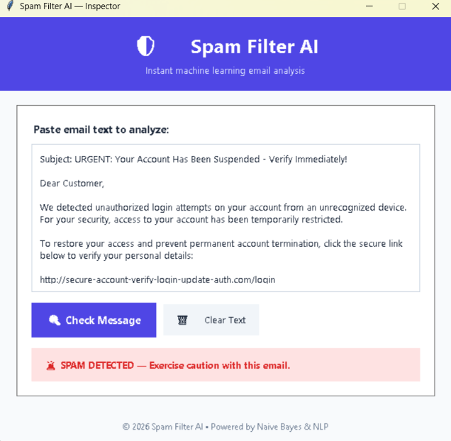

# Spam Filter AI

Spam Filter AI is a student machine learning project that classifies email text as spam or not spam.
It combines natural language preprocessing, TF-IDF feature extraction, and a Naive Bayes classifier.

## Project Summary

This project demonstrates a complete NLP pipeline:

- Text preprocessing with token cleanup, stopword removal, and stemming
- Feature extraction using TF-IDF
- Model training with Multinomial Naive Bayes
- A simple desktop GUI to test email text in real time

## Features

- Paste email content directly into the app
- Click one button to classify as spam or not spam
- Clear text quickly with Delete Mail button
- Reproducible training pipeline using separate scripts

## Screenshot

The image below shows the spam classification interface in action.



## How the Pipeline Works

### Preprocessing (data_preprocessing.py)

Raw text undergoes tokenization, lowercasing, and stopword removal via NLTK to retain only meaningful terms.

### Feature Extraction (feature_extraction.py)

The clean text is converted into numerical vectors using TF-IDF (Term Frequency - Inverse Document Frequency) vectorization to capture word importance across the corpus.

### Classification (model.py)

A Multinomial Naive Bayes classifier calculates conditional probabilities based on the extracted TF-IDF features to determine whether an input is spam or legitimate.

### Interface (gui.py)

A basic Tkinter window allows users to paste an email body directly, hit Submit Email, and receive real-time classification results.

## Tech Stack

- Python
- pandas
- scikit-learn
- nltk
- tkinter
- joblib

## Project Structure

```text
Spam-Filter-AI/
|-- assets/
|   |-- screenshots/
|   |   |-- spam-filter-ai-screenshot.png
|-- data/
|   |-- emails.csv
|   |-- preprocessed_emails.csv
|-- src/
|   |-- __init__.py
|   |-- data_preprocessing.py
|   |-- evaluation.py
|   |-- feature_extraction.py
|   |-- gui.py
|   |-- model.py
|-- requirements.txt
|-- README.md
|-- spam_detector_model.pkl
|-- tfidf_vectorizer.pkl
|-- X_features.pkl
|-- X_test.pkl
|-- y_test.pkl
```

## Setup

### 1) Create virtual environment

Windows (PowerShell):

```powershell
python -m venv venv
.\venv\Scripts\Activate.ps1
```

macOS/Linux:

```bash
python3 -m venv venv
source venv/bin/activate
```

### 2) Install dependencies

```bash
pip install -r requirements.txt
```

## Data Preparation

Place your dataset in the data folder.
Expected training file:

- data/emails.csv with columns:
  - text
  - spam (0 or 1)

## Training Pipeline Commands

Run these commands from the project root in order:

```bash
python src/data_preprocessing.py
python src/feature_extraction.py
python src/model.py
```

What these commands generate:

- data/preprocessed_emails.csv
- X_features.pkl
- tfidf_vectorizer.pkl
- spam_detector_model.pkl

Optional evaluation artifact generation:

```bash
python src/evaluation.py
```

This also creates:

- X_test.pkl
- y_test.pkl

## Run the GUI

```bash
python src/gui.py
```

## How to Use the App

1. Paste an email into the text box.
2. Click Submit Email.
3. Read the classification result.
4. Click Delete Mail to clear input.

## Troubleshooting

### NLTK import could not be resolved

Make sure VS Code is using the same Python interpreter where packages are installed.
Then run:

```bash
pip install nltk
```

### Model file not found

If the GUI reports missing model/vectorizer files, run the full training pipeline:

```bash
python src/data_preprocessing.py
python src/feature_extraction.py
python src/model.py
```

## Academic Note

This is a practice project built for learning NLP and machine learning workflow design.
It is suitable for coursework demos, mini-project submissions, and portfolio learning documentation.

## License

This project uses the GNU General Public License v3.0.
